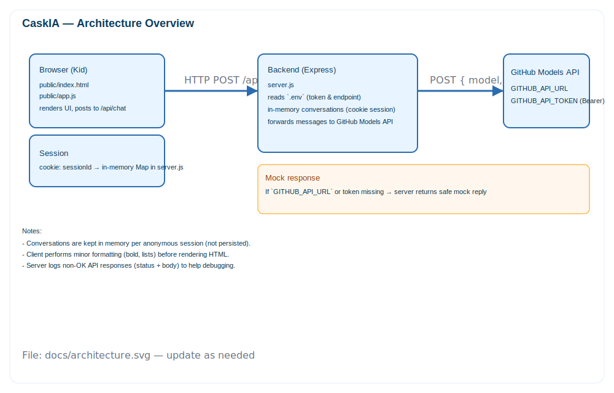
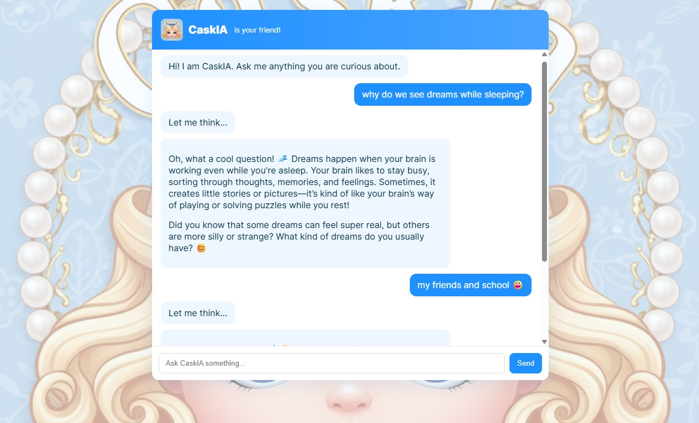

# CaskIA — Kid-friendly Chat

This is a minimal chat app for for kids (age 8+) with a Node/Express backend and a static frontend. The server can call GitHub-hosted models via a configurable API endpoint; if you don't configure the endpoint, the server returns a mock response so you can try the UI locally.

Disclaimer: This app is purely for learning purpose and not recomended for production use.


## Quick start (Windows PowerShell):

1. Install dependencies

```powershell
cd "D:\Projects\Caskia"
npm install
```

2. Create a `.env` file from the example and add your token

```powershell
copy .env.example .env
# Edit .env and set GITHUB_API_TOKEN (do NOT commit this file)
notepad .env
```

3. Run the server

```powershell
npm start
# then open http://localhost:3000 in your browser
```

## Notes

- Store your GitHub personal access token in `.env` as `GITHUB_API_TOKEN`.
- Optionally set `GITHUB_API_URL` and `GITHUB_MODEL` if you have a specific GitHub models endpoint. If those are not set, the server uses a mock reply so the UI remains usable.
- Conversations are kept in-memory per anonymous session (cookie-based). They are not persisted to disk.

## How this app works

- **Frontend (`public/`)**: a simple single-page chat UI (`index.html`, `app.js`, `styles.css`). The UI sends user messages to the server at `POST /api/chat` and renders replies. Text formatting supported by the UI:
	- `**bold**` → rendered as bold text.
	- Numbered lists like `1. A 2. B` or newline-separated lists are converted to proper `<ol>` / `<ul>` elements for readability.
- **Backend (`server.js`)**: an Express server that accepts chat messages, keeps an in-memory conversation per anonymous cookie session, and forwards the conversation (with a kid-friendly system prompt) to the configured AI endpoint.
- **Model adapter**: the backend calls the URL in `GITHUB_API_URL` with a JSON body `{ model, messages }` and `Authorization: Bearer <token>`. If `GITHUB_API_URL` or `GITHUB_API_TOKEN` is missing, the server returns a safe mock reply so you can test the UI without a configured model.

## Files of interest

- `server.js` — Express server and model adapter
- `public/index.html`, `public/app.js`, `public/styles.css` — frontend
- `public/assets/caskia.png` — logo (place your logo here)
- `public/assets/bg.png` — background image used with 50% opacity
- `.env.example` — environment variables template

## Technical Design

(AI generated)

## Prompt Used

"You are CaskIA, a friendly chat assistant for kids aged 8-14. Use simple language, short sentences, a cheerful tone, avoid adult topics, and ask clarifying questions when helpful. If a user asks about something unsafe, respond with a gentle refusal and suggest a safe alternative."


## Troubleshooting & debugging

- If you see `GitHub API error 404: 404 page not found` in server logs, the `GITHUB_API_URL` is likely incorrect (wrong host or path) or the request shape doesn't match the endpoint. Check the URL and model id in your `.env`.
- The server logs non-OK responses from the API (status and response body) to help diagnose issues.
- To test the API manually in PowerShell (replace placeholders):

```powershell
$body = '{ "model":"<GITHUB_MODEL>", "messages":[{"role":"system","content":"You are CaskIA."},{"role":"user","content":"Hello"}] }'
Invoke-RestMethod -Uri '<GITHUB_API_URL>' -Method Post -Headers @{ Authorization = 'Bearer <GITHUB_API_TOKEN>'; 'Content-Type' = 'application/json'; Accept = 'application/vnd.github+json' } -Body $body | ConvertTo-Json
```

## Security

- Never commit `.env` to source control. Add it to `.gitignore` if you plan to commit.


## Screenshots


